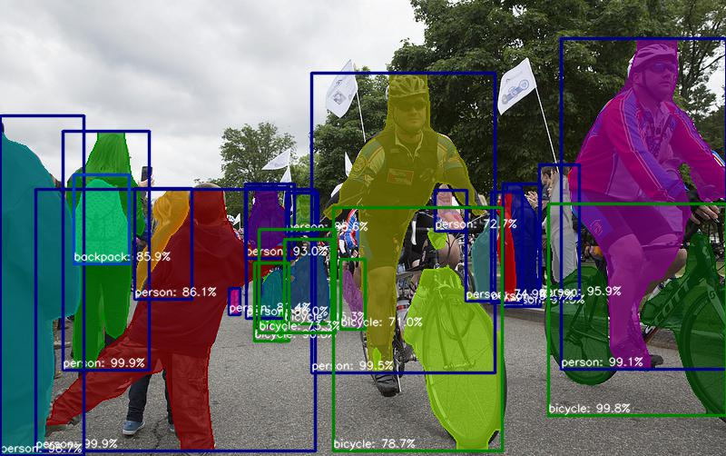
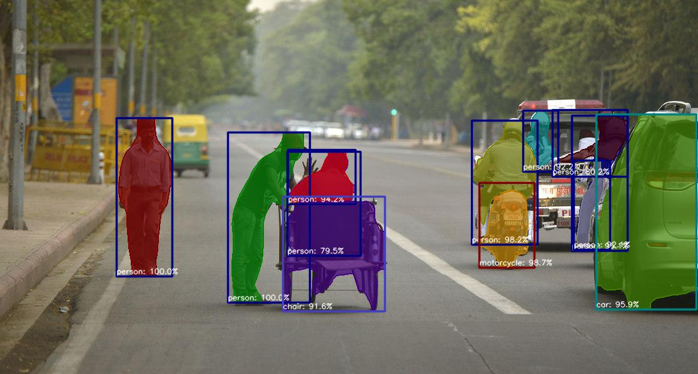

# chainer-mask-rcnn

Chainer Implementation of [Mask R-CNN](https://arxiv.org/abs/1703.06870).  
It includes:

- ResNet50, ResNet101 backbone (FPN not included)
- [VOC and COCO training examples](examples).

   
*Fig 1. Mask R-CNN, ResNet50, 4GPU, 20180225, COCO 28.3 mAP@50:95 (31.4 in original work with 8GPU)*


## Training

See [examples](examples).


## Installation


### For single GPU training

```bash
conda install -c conda-forge -y opencv
pip install .
```


### For multi GPU training

- Install [OpenMPI](https://www.open-mpi.org/software/ompi/v3.0/)

```bash
wget https://www.open-mpi.org/software/ompi/v3.0/downloads/openmpi-3.0.0.tar.gz
tar zxvf openmpi-3.0.0.tar.gz
cd openmpi-3.0.0
./configure --with-cuda
make -j4
sudo make install
sudo ldconfig
```

- Install [NCCL](https://developer.nvidia.com/nccl)

```bash
# dpkg -i nccl-repo-ubuntu1404-2.1.4-ga-cuda8.0_1-1_amd64.deb
dpkg -i nccl-repo-ubuntu1604-2.1.15-ga-cuda9.1_1-1_amd64.deb
sudo apt update
sudo apt install libnccl2 libnccl-dev
```

- Install [ChainerMN](https://github.com/chainer/chainermn)

```bash
pip install chainermn
```

- Install [chainer-mask-rcnn](https://github.com/wkentaro/chainer-mask-rcnn)

```bash
conda install -c conda-forge -y opencv
pip install .
```


## Testing

```bash
pip install hacking pytest
flake8 .
pytest tests
```


## ROS integration (real-time demo)

It runs in around 10fps.
See https://github.com/jsk-ros-pkg/jsk_recognition/pull/2257.


