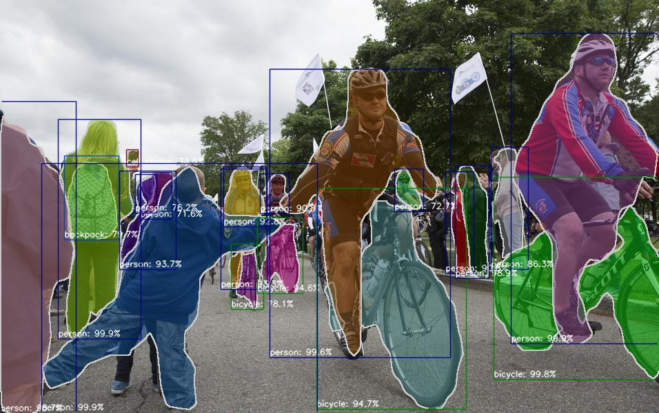
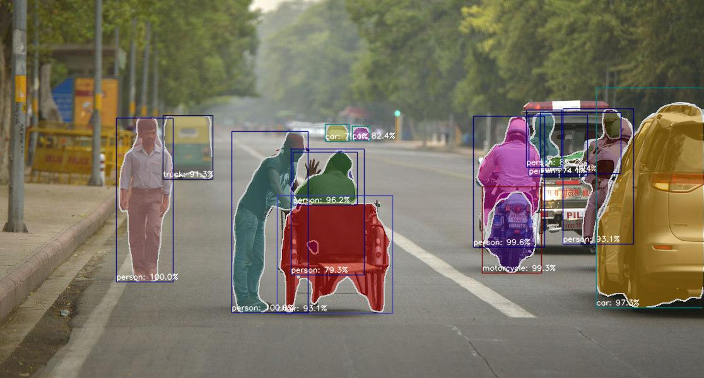

# chainer-mask-rcnn

[](https://badge.fury.io/py/chainer-mask-rcnn)
[](https://travis-ci.com/wkentaro/chainer-mask-rcnn)

Chainer Implementation of [Mask R-CNN](https://arxiv.org/abs/1703.06870).

## Features

- [x] ResNet50, ResNet101 backbone.
- [x] [VOC and COCO training examples](examples).
- [x] **[Reproduced result of original work (ResNet50, COCO)](https://github.com/wkentaro/chainer-mask-rcnn#coco-results)**.
- [x] Weight copy from pretrained model at [facebookresearch/Detectron](https://github.com/facebookresearch/Detectron).
- [ ] Support FPN backbones.
- [ ] Keypoint detection.

   
*Fig 1. Mask R-CNN, ResNet50, 8GPU, Ours, COCO 31.4 mAP@50:95*


## COCO Results

| Model | Implementation | N gpu training | mAP@50:95 |
|-------|----------------|----------------|-----------|
| Mask R-CNN, ResNet50 | [Ours](https://github.com/wkentaro/chainer-mask-rcnn) | 8 | 31.4 |
| Mask R-CNN, ResNet50 | [facebookresearch/Detectron](https://github.com/facebookresearch/Detectron) | 8 | 31.4 (30.7 after copied) |
| FCIS, ResNet50 | [msracver/FCIS](https://github.com/msracver/FCIS) | 8 | 27.1 |


## Training

See [examples](examples).


## Inference

```bash
# you can use your trained model
./demo.py logs/<YOUR_TRAINING_LOG> --img <IMAGE_PATH_OR_URL>

# copy weight from caffe2 to chainer
cd examples/coco
./convert_caffe2_to_chainer.py
./demo.py logs/R-50-C4_x1_caffe2_to_chainer --img https://raw.githubusercontent.com/facebookresearch/Detectron/master/demo/33823288584_1d21cf0a26_k.jpg
./demo.py logs/R-50-C4_x1_caffe2_to_chainer --img https://raw.githubusercontent.com/facebookresearch/Detectron/master/demo/17790319373_bd19b24cfc_k.jpg
```

   
*Fig 2. Mask R-CNN, ResNet50, 8GPU, Copied from Detectron, COCO 31.4 mAP@50:95*


## Installation


### Single GPU Training

```bash
# Install Chainer Mask R-CNN.
pip install opencv-python
pip install .

# Run training!
cd examples/coco && ./train.py --gpu 0
```


### Multi GPU Training

```bash
# Install OpenMPI
wget https://www.open-mpi.org/software/ompi/v3.0/downloads/openmpi-3.0.0.tar.gz
tar zxvf openmpi-3.0.0.tar.gz
cd openmpi-3.0.0
./configure --with-cuda
make -j4
sudo make install
sudo ldconfig

# Install NCCL
# dpkg -i nccl-repo-ubuntu1404-2.1.4-ga-cuda8.0_1-1_amd64.deb
dpkg -i nccl-repo-ubuntu1604-2.1.15-ga-cuda9.1_1-1_amd64.deb
sudo apt update
sudo apt install libnccl2 libnccl-dev

# Install ChainerMN
pip install chainermn

# Finally, install Chainer Mask R-CNN.
pip install opencv-python
pip install .

# Run training!
cd examples/coco && mpirun -n 4 ./train.py --multi-node
```


## Testing

```bash
pip install flake8 pytest
flake8 .
pytest -v tests
```
