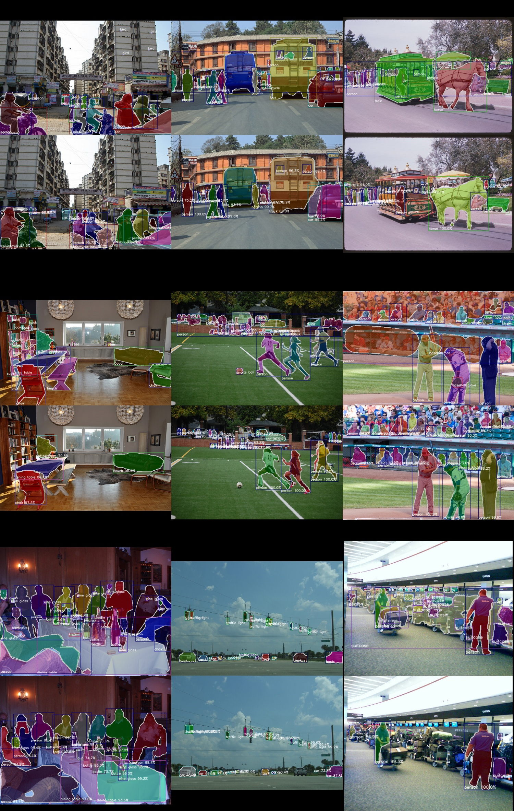

# COCO Example

## Usage

```bash
./download_datasets.py

# single gpu training
./train.py --gpu 0

# multi gpu training
mpirun -n 4 ./train.py --multi-node

./evaluate.py logs/<log_dir> --gpu 0
./demo.py logs/<log_dir> --gpu 0 --img <img_file_or_url>
```


## Result

| Model | Implementation | N gpu training | mAP@50:95 | Log |
|-------|----------------|----------------|-----------|-----|
| Mask R-CNN, ResNet50 | [Ours](https://github.com/wkentaro/chainer-mask-rcnn) | 8 | 31.4 | [Log](https://drive.google.com/open?id=1DRt96S0asaAiN5aDiWUYVcPs0bQ_USU3) |
| Mask R-CNN, ResNet50 | [facebookresearch/Detectron](https://github.com/facebookresearch/Detectron) | 8 | 31.4 (30.7 after copied) | [Log](https://drive.google.com/open?id=1xQBox3uMv2FoyXXpsC9ASNZ-92NgAbcT) |
| FCIS, ResNet50 | [msracver/FCIS](https://github.com/msracver/FCIS) | 8 | 27.1 | - |

See [here](https://drive.google.com/open?id=1Dfpc2Dd7_hh9ZsgfbDnuVG4xUnQFBksa) for training logs.



*Fig 1. Mask R-CNN, ResNet50, Ours, 31.4 mAP@50:95.*


## Caffe2 (Detectron) to Chainer

```bash
./convert_caffe2_to_chainer.py

./evaluate.py logs/R-50-C4_x1_caffe2_to_chainer

./demo.py logs/R-50-C4_x1_caffe2_to_chainer
```

   
*Fig 1. Inference results: Caffe2 (left), Chainer (right).*


## Speed test (vs. PyTorch implementation)

Configuration:

- GTX 1080Ti (used also on monitor)
- CUDA 8.0.61
- CUDNN 5.1.10
- PyTorch 1.0.0.dev20181024 (with `conda install pytorch-nightly cuda80 -c pytorch`)
- Chainer 5.0.0, Cupy 5.0.0 (with `pip install chainer cupy-cuda80`)

- CPU -> GPU communication of input.
- BBox prediction and suppression.
- Mask prediction for remaining bboxes (nms thresh: 0.5, score thresh: 0.7).
- GPU -> CPU communication of output.

```bash
# Chainer implementation (this repo)
% pwd
/home/wkentaro/chainer-mask-rcnn/examples/coco
% ./speedtest.py --gpu 0 --times 10
==> Benchmark: gpu=0, times=10
==> Image file: https://raw.githubusercontent.com/facebookresearch/Detectron/master/demo/33823288584_1d21cf0a26_k.jpg
==> Testing Mask R-CNN RestNet50-C4 with Chainer
Elapsed time: 3.09 [s / 10 evals]
Hz: 3.24 [hz]

# PyTorch implementation (https://github.com/facebookresearch/maskrcnn-benchmark)
% git clone https://github.com/wkentaro/maskrcnn-benchmark.git -b speedtest_r50_c4  # then install it
% pwd
/home/wkentaro/maskrcnn-benchmark/demo
% ./speedtest.py --gpu 0 --times 10
==> Benchmark: gpu=0, times=10
==> Image file: https://raw.githubusercontent.com/facebookresearch/Detectron/master/demo/33823288584_1d21cf0a26_k.jpg
==> Testing Mask R-CNN ResNet-C4 with PyTorch
Elapsed time: 3.44 [s / 10 evals]
Hz: 2.91 [hz]
```
