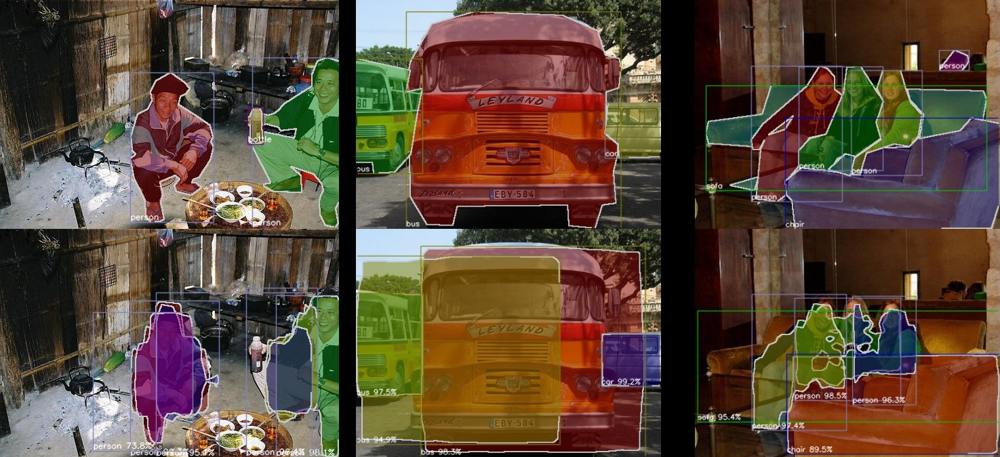

# Custom Dataset Example

This is an example of training Mask R-CNN with a custom dataset.  
Note that this example runs training using only 3 images,
and same dataset for both training and testing.


## Usage

```bash
./train.py --gpu 0

./demo.py <log_dir> --img src/labelme/examples/instance_segmentation/data_dataset_voc/JPEGImages/2011_000003.jpg

./evaluate.py <log_dir>

./summarize_logs.py
```




*Fig 1. Training result after training with given images around 200 times (top: ground truth, bottom: inference result)*


## VOC-like dataset

```bash
% ls -lha src/labelme/examples/instance_segmentation/data_dataset_voc/*
-rw-rw-r-- 1 wkentaro wkentaro  149 Jun 13 20:07 src/labelme/examples/instance_segmentation/data_dataset_voc/class_names.txt

src/labelme/examples/instance_segmentation/data_dataset_voc/JPEGImages/:
total 132K
drwxrwxr-x 2 wkentaro wkentaro 4.0K Jun 13 20:07 .
drwxrwxr-x 7 wkentaro wkentaro 4.0K Jun 13 20:26 ..
-rw-rw-r-- 1 wkentaro wkentaro  46K Jun 13 20:07 2011_000003.jpg
-rw-rw-r-- 1 wkentaro wkentaro  29K Jun 13 20:07 2011_000006.jpg
-rw-rw-r-- 1 wkentaro wkentaro  44K Jun 13 20:07 2011_000025.jpg

src/labelme/examples/instance_segmentation/data_dataset_voc/SegmentationClass/:
total 1.8M
drwxrwxr-x 2 wkentaro wkentaro 4.0K Jun 13 20:26 .
drwxrwxr-x 7 wkentaro wkentaro 4.0K Jun 13 20:26 ..
-rw-rw-r-- 1 wkentaro wkentaro 661K Jun 13 20:26 2011_000003.npy
-rw-rw-r-- 1 wkentaro wkentaro 733K Jun 13 20:26 2011_000006.npy
-rw-rw-r-- 1 wkentaro wkentaro 733K Jun 13 20:26 2011_000025.npy

src/labelme/examples/instance_segmentation/data_dataset_voc/SegmentationClassVisualization/:
total 100K
drwxrwxr-x 2 wkentaro wkentaro 4.0K Jun 13 20:07 .
drwxrwxr-x 7 wkentaro wkentaro 4.0K Jun 13 20:26 ..
-rw-rw-r-- 1 wkentaro wkentaro  32K Jun 13 20:07 2011_000003.jpg
-rw-rw-r-- 1 wkentaro wkentaro  24K Jun 13 20:07 2011_000006.jpg
-rw-rw-r-- 1 wkentaro wkentaro  33K Jun 13 20:07 2011_000025.jpg

src/labelme/examples/instance_segmentation/data_dataset_voc/SegmentationObject/:
total 1.8M
drwxrwxr-x 2 wkentaro wkentaro 4.0K Jun 13 20:26 .
drwxrwxr-x 7 wkentaro wkentaro 4.0K Jun 13 20:26 ..
-rw-rw-r-- 1 wkentaro wkentaro 661K Jun 13 20:26 2011_000003.npy
-rw-rw-r-- 1 wkentaro wkentaro 733K Jun 13 20:26 2011_000006.npy
-rw-rw-r-- 1 wkentaro wkentaro 733K Jun 13 20:26 2011_000025.npy

src/labelme/examples/instance_segmentation/data_dataset_voc/SegmentationObjectVisualization/:
total 100K
drwxrwxr-x 2 wkentaro wkentaro 4.0K Jun 13 20:26 .
drwxrwxr-x 7 wkentaro wkentaro 4.0K Jun 13 20:26 ..
-rw-rw-r-- 1 wkentaro wkentaro  31K Jun 13 20:26 2011_000003.jpg
-rw-rw-r-- 1 wkentaro wkentaro  23K Jun 13 20:26 2011_000006.jpg
-rw-rw-r-- 1 wkentaro wkentaro  33K Jun 13 20:07 2011_000025.jpg
```
