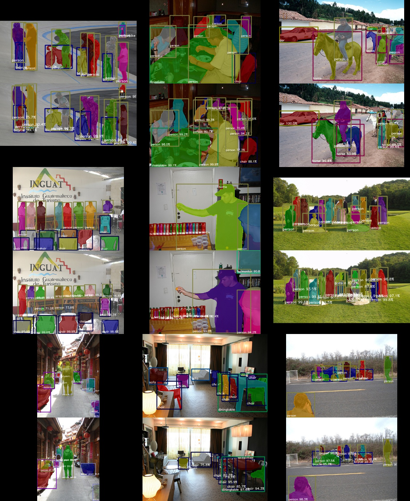

# VOC Example

## Usage

```bash
./download_datasets.py

# single gpu training
./train.py --gpu 0

# multi gpu training
mpiexec -n 4 ./train.py --multi-node
```


## Result

| Model               | Implementation | N gpu training | mAP  |
|---------------------|----------------|----------------|------|
| Mask R-CNN, ResNet50 | [Ours](https://github.com/wkentaro/chainer-mask-rcnn) | 4 | 65.2 |
| Mask R-CNN, ResNet101 | [Ours](https://github.com/wkentaro/chainer-mask-rcnn) | 4 | |
| FCIS, ResNet101 | [msracver/FCIS](https://github.com/msracver/FCIS) | 8 | 66.0 |


Fig 1. Mask R-CNN, ResNet50, Ours.
