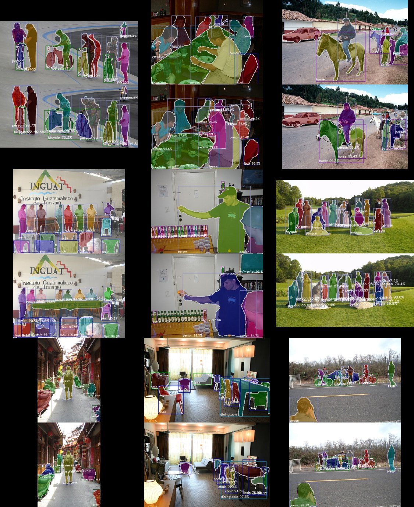
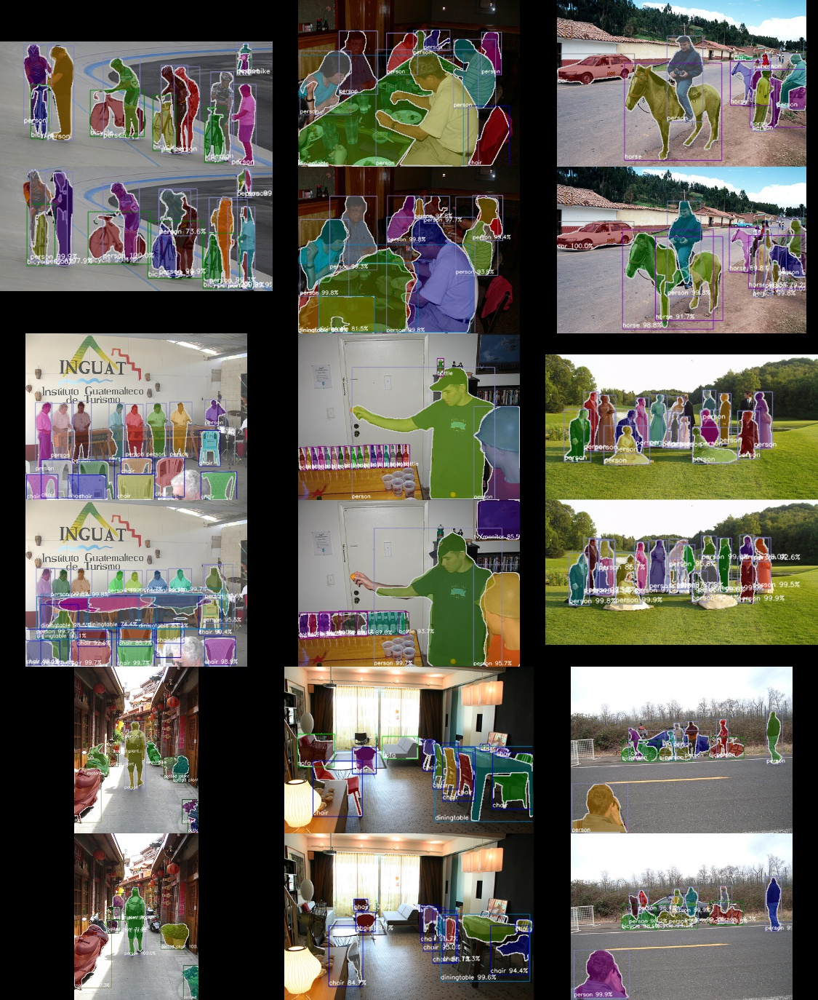

# VOC Example

## Usage

```bash
./download_datasets.py

# single gpu training
./train.py --gpu 0

# multi gpu training
mpiexec -n 4 ./train.py --multi-node
```


## Result

| Model               | Implementation | N gpu training | mAP@50  |
|---------------------|----------------|----------------|---------|
| Mask R-CNN, ResNet50 | [Ours](https://github.com/wkentaro/chainer-mask-rcnn), `20180516_182644` | 4 | 66.8 |
| Mask R-CNN, ResNet101 | [Ours](https://github.com/wkentaro/chainer-mask-rcnn), `20180516_231137` | 4 | 68.1 |
| Mask R-CNN, ResNet101 | [Ours](https://github.com/wkentaro/chainer-mask-rcnn) | 8 | `TODO(wkentaro)` |
| FCIS, ResNet101 | [msracver/FCIS](https://github.com/msracver/FCIS) | 8 | 66.0 |

  
Fig 1. Mask R-CNN, ResNet50, Ours, 66.8 mAP@50.

  
Fig 2. Mask R-CNN, ResNet101, Ours, 68.1 mAP@50.

See [here](https://drive.google.com/open?id=1-aqbWUgjs3E7xQgXTpSSBKSpPhcUa4V_) for training logs.
