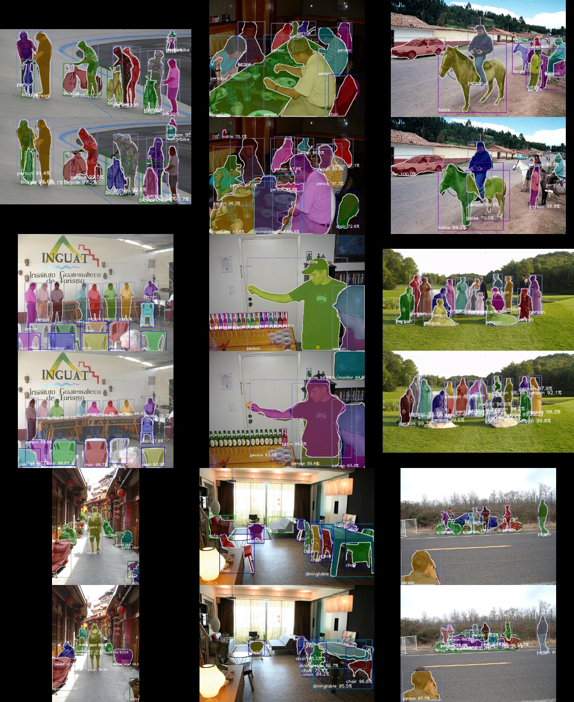

# VOC Example

## Usage

```bash
./download_datasets.py

# single gpu training
./train.py --gpu 0

# multi gpu training
mpirun -n 4 ./train.py --multi-node
```


## Result

| Model               | Implementation | N gpu training | mAP@50  |
|---------------------|----------------|----------------|---------|
| Mask R-CNN, ResNet50 | [Ours](https://github.com/wkentaro/chainer-mask-rcnn) | 4 | 66.0 |
| Mask R-CNN, ResNet50 | [Ours](https://github.com/wkentaro/chainer-mask-rcnn) | 8 | 65.5 |
| Mask R-CNN, ResNet101 | [Ours](https://github.com/wkentaro/chainer-mask-rcnn) | 4 | 67.5 |
| Mask R-CNN, ResNet101 | [Ours](https://github.com/wkentaro/chainer-mask-rcnn) | 8 | 67.1 |
| FCIS, ResNet101 | [msracver/FCIS](https://github.com/msracver/FCIS) | 8 | 66.0 |

See [here](https://drive.google.com/open?id=1-aqbWUgjs3E7xQgXTpSSBKSpPhcUa4V_) for training logs.

   
*Fig 1. Mask R-CNN, ResNet50, Ours, 66.0 mAP@50 (left), Mask R-CNN, ResNet101, Ours, 67.5 mAP@50 (right).*
